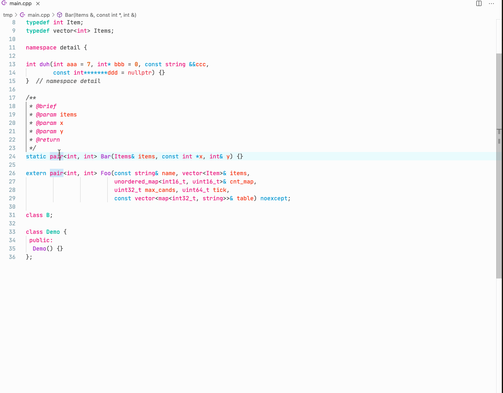

# cpp-comment-generator README

Generate doxygen comments for selected class declaration or function declaration.

## Features
1. select the first line of a class declaration or a function declaration, run writeComments command to generate javadoc style doxygen comments with parameter names.
2. configure author name by running configAuthor command and input your name
3. to comment template class or template function, select template parameter-list declaration.

## Known issues
1. Doesn't work if template declaration and class/function declaration are in one line.

## License
This extension is [licensed under the MIT License](LICENSE.txt).
